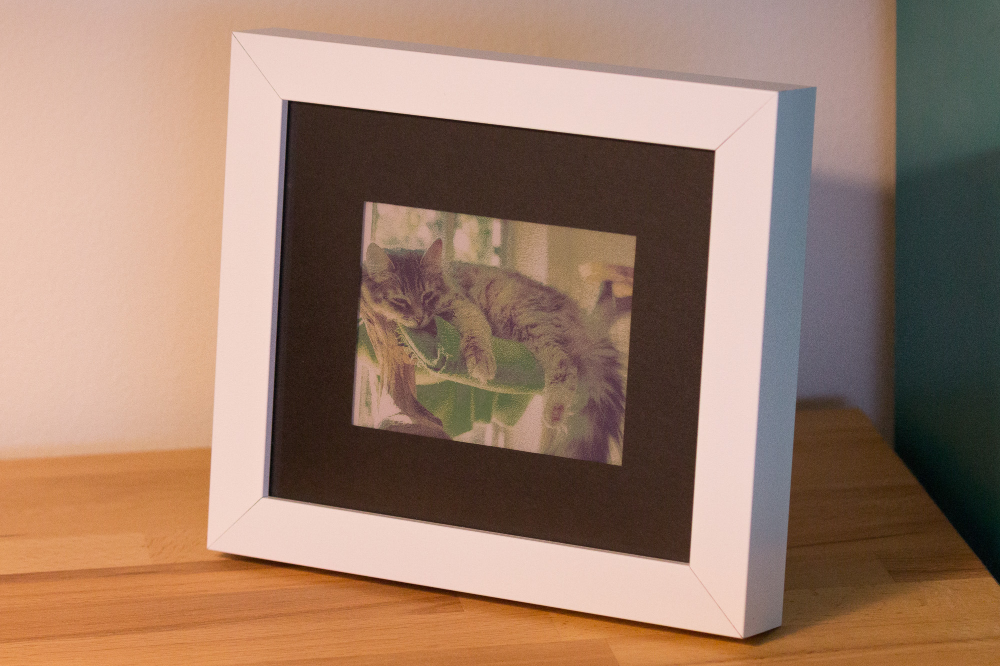
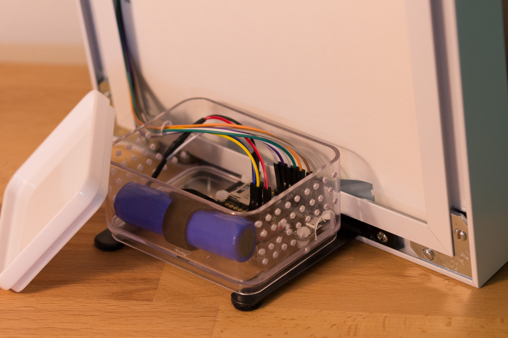

# E-Paper Picture Frame

Arduino sketch for the [Adafruit Feather M0 Adalogger](https://www.adafruit.com/product/2796) that turns the [WaveShare 5.65" 7-color 600x448-pixel E-Paper display](https://www.waveshare.com/product/displays/e-paper/epaper-1/5.65inch-e-paper-module-f.htm) into a battery-powered digital picture frame, showing a different image from a MicroSD card every day.

Inspiration for this project came from [CNLohr's prank frame](https://www.youtube.com/watch?v=YawP9RjPcJA) that uses the same display. Code to drive the display based on [Waveshare's Arduino sample](https://github.com/waveshare/e-Paper/tree/master/Arduino/epd5in65f). Additional details about the display are available in the [technical specification](https://www.waveshare.com/w/upload/7/7a/5.65inch_e-Paper_%28F%29_Sepecification.pdf) and [application note](https://www.waveshare.com/w/upload/b/b5/5.65inch_e-Paper_%EF%BC%88F%EF%BC%89_Application_Note_Reference_Design.pdf) PDFs.

## Dependencies

* [Adafruit SAMD Boards](https://github.com/adafruit/ArduinoCore-samd) (tested version 1.7.3)
* [ArduinoLowPower](https://github.com/arduino-libraries/ArduinoLowPower) (tested version 1.2.2)
* [RTCZero](https://github.com/arduino-libraries/RTCZero) (tested version 1.6.0)
* [SdFat](https://github.com/greiman/SdFat) (tested version 2.0.7)

## Pin Assignments

The Feather M0 provides the following:

| Pin       | Connection                                                            |
| --------- | --------------------------------------------------------------------- |
| 4         | SD card SPI CS                                                        |
| 7         | SD card detect switch                                                 |
| 8         | SD card LED                                                           |
| 9 / A7    | 1:1 voltage divider to measure battery voltage                        |
| 13        | Red power LED                                                         |
| 22        | SD card SPI MISO                                                      |
| 23        | SD card SPI MOSI                                                      |
| 24        | SD card SPI CLK                                                       |

And the sketch expects some additional connections:

| Pin       | Connection                                                            |
| --------- | --------------------------------------------------------------------- |
| 3V3       | E-Paper VCC                                                           |
| GND       | E-Paper GND                                                           |
| 11        | E-Paper SPI MOSI                                                      |
| 12        | E-Paper SPI CLK                                                       |
| 15        | E-Paper SPI CS                                                        |
| 16        | E-Paper DC (data/command selector)                                    |
| 17        | E-Paper Reset                                                         |
| 18        | E-Paper Busy                                                          |
| 19 / A5   | 1:1 voltage divider between USB and GND to measure the USB voltage    |

SERCOM 1 is configured as an additional hardware SPI bus using the above pins to provide fast access to the display while leaving the SD card on its default settings.

The sketch assumes you will primarily be powering the frame using a 3.7V Li-ion/Li-poly battery connected to the JST connector (I used [Adafruit's 2200mAh Li-Ion](https://www.adafruit.com/product/1781)). However, you could also power it solely from USB if desired.

## Schematic

## Operation

In normal operation, the sketch wakes up every day around 3am to load the next image, otherwise it sleeps in a low-power mode. If the battery goes below 3.5V, a warning message to charge is shown, and plugging in a USB cable resumes showing the current image while charging. Unplugging will revert to the warning if the battery is still too low. Inserting the SD card will reload the current image in case you want to make any tweaks to it after seeing it on the display. All state is in-memory only, so resetting or losing power will start over with the first image.

## Setup

To avoid any sort of time-setting UI, the sketch hardcodes an assumption about the initial time in the constants under `rtc::initial`. To ensure the image actually switches in the middle of the night, power on or hit the reset button at that time (adjusting the constants as convenient).

If you have to reset or lose power, you can set `PreviousFileName` and reflash in order to pick up at the next image instead of starting over.

### SD Card Layout

* The file `/system/LowBattery.bin` (included in this repo) is expected to exist for the low battery message. If it's missing, a red screen is shown instead.
* Any file in the root directory of the correct size is loaded as an image. All other folders are ignored.

### File format

The image file format is simply raw the bytes to send to the display. Two 4-bit pixels are packed into each byte, where each pixel value is an index into this color table:

| Index | Color  |
| ----- | ------ |
| 0     | Black  |
| 1     | White  |
| 2     | Green  |
| 3     | Blue   |
| 4     | Red    |
| 5     | Yellow |
| 6     | Orange |
| 7     | Clean* |

\* "Clean" is a light purple color that's supposed to be used for clearing the display between images to reduce ghosting, but there's nothing stopping you from using it for individual pixels in a normal image as well. Not sure if there's a reason that Waveshare doesn't seem to to want you to do this, though.

Pixels start at the top left of the image and proceed left to right, top to bottom. Each file should be 600 x 448 / 2 = 134,400 bytes.

One option to create these raw images is my [epaper-dither](https://github.com/alusch/epaper-dither) tool which automates dithering and appending new images after previous ones; all you need to do is crop and resize the input images appropriately.

## Testing

Set the `DebugMode` constant to `true` to wake up every minute instead of every day to more easily test image loading.

## Physical Design

The dimensions of the viewable area on the display are 114.9mm × 85.79mm or about 4 1/2" × 3 3/8".

To keep things simple, I opted for a custom frame from [American Frame](https://www.americanframe.com). I chose a frame with a deep "R" dimension (depth of the recess for the photo) to have plenty of room for the display.

Since the E-Paper is pretty low-contrast, I chose a black mat to help it stand out better. I also chose the "reverse bevel cut" option so there wouldn't be any white visible around the cutout. I also went with 1/16" mat overlap on each side to show as much of the image as possible while still allowing a bit of tolerance.

My final order was:

* [Bright White Metal Frame SP152](https://www.americanframe.com/frames/bright-white-metal-frame-sp152.aspx) (7 3/8 x 6 1/4)
    * Bainbridge Papermat Black Mat Board E4089 (7 3/8 x 6 1/4) Width: 1 1/2", Reverse Bevel Cut
    * UV Non Glare Picture Framing Acrylic AAUVNG (7 3/8 x 6 1/4)
    * Archival Mounting Board MTBA (7 3/8 x 6 1/4)
* [EaselMate F5010](https://www.americanframe.com/products/easelmate-f5010.aspx) for tabletop display

With some effort, you could get the electronics into the frame itself, but I wanted to keep things simple and provide easier access to the SD card and USB port, so I went with a separate electronics box that sits behind the frame itself. I just used a small plastic storage box with a lid that I drilled some holes in for ventilation and to provide access to the USB port. Though in retrospect, it's a bit awkward to insert or remove the SD card, so it might have been better to provide direct access to that through a slot and use an extension cable for the USB port.

Yeah, it's not very pretty, but it works and is hidden behind the frame 🙂

## License

Distributed under the [MIT license].

[MIT license]: /LICENSE
